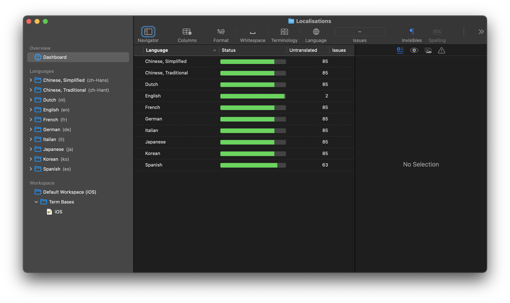

# Localisations
Localisation files used within the Pockity apps.

### Base Localisations
The base locations have been translated using Google Translate and DeepL. Some localisations may be incorrect. If you find any inaccuracies or incorrect translations, please submit a PR with the corrections or open an issue. 

### Localisations
- [x] English (en-US)
- [ ] Chinese Simplified (zh-Hans)
- [ ] Korean (ko)
- [ ] Italian (it)
- [ ] Spanish (es)
- [ ] German (de)
- [ ] French (fr)
- [ ] Japanese (ja)
- [ ] Dutch (nl) 

A languge is marked with a checkmark once it has been fully verified and up-to-date. If updates are issued with incompleted or unverified translations, the checkmark is removed. 

### New Languages
If you'd like to help add new language/s to the repository, please get in touch with me at [support@pockity.app](support@pockity.app) and I'll add the base files required for translating the language.

## Instructions for Corrections
**A. Open an issue** 
1. Open an issue and mention the line number and file in which the incorrect translation appears.
2. Mention the correct translation string. 

**B. Submit a PR**

1. Download the [Loca Studio App](https://www.cunningo.com/locastudio/index.html) from their website. It's an excellent app for translating `xcloc` files. 
2. Clone or download this repository from Github 
3. Open the `Localisations` folder in Loca Studio 
4. Select the language you'll be translating from the sidebar 
5. Make you changes/corrections as necessary in the `Target` column. 
6. Save the file frequently to ensure no errors have occurred. 
7. 
  - If you download a zip from Github, you can send me an archive of the folder to [support@pockity.app](mailto:support@pockity.app)
  - If you cloned the repository, you should commit and push your changes to your fork and then open a PR to this repository. 

You can refer to the app's help guide [here](https://www.cunningo.com/locastudio/support/index.html).

## License
The contents of this repository are licensed under the MIT license. (Will evaluate if Creative Commons License is more appropriate shortly). 

This means if you find any translations useful for your own apps, please feel free to use them.
